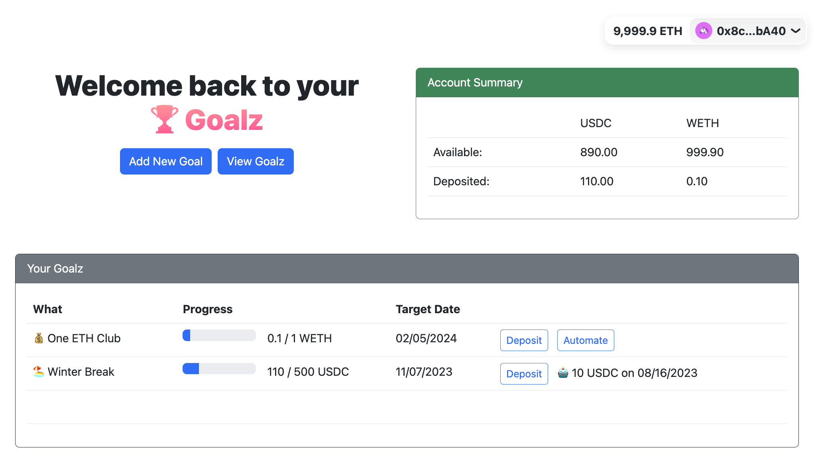

# Goalz: Onchain Savings Accounts with a Purpose

## Problem: Saving is hard
There are important things in life that we want to buy. Without savings, people either don't buy or will use credit to buy. Saving money in a single savings account can be challenging by itself. It becomes even harder when you are trying to save for multiple things at the same time within a single savings account. Tools like Mint support savings goals but are limited to one goal per one account. To make many savings goals with Mint requires making many seperate savings account. This can be done in traditional finance but it's difficult and out of reach for some people.

### Existing Solutions & Their Limitations

#### Savings Goal Mobile Apps
These applications available in iOS and Android let you set up savings schedules. They will tell you how much you need to save to rach your goal and will give you alerts when it's time to save.

##### Limitations
* Not connected to a bank account
* Not automated so you have to manually make deposits
* Essentially a reminder tool

#### Mint Savings Goals
This application through mint let's you create goals for things like paying down debt or saving for a downpayment on a car/house. It includes features that take things like interest rates into account. You can select one of you connected accounts to use to track your progress

##### Limitations
* Must open a dedicated account for each goal
* Can't automated deposits through Mint, must be set up through your bank
* Goal tracking is view only 

## Goalz Solution: Blockchain-based Savings Accounts
Goalz is a decentralized application you can use to manage multiple savings goals in an user friendly way. Goalz uses Base blockchain to allow you to make individual savings accounts for all of your savings goals using a single wallet. Goalz makes it easy to make many savings goals and automate the savings process. 

### Features
* Create multiple savings goals
* Create automated deposits when creating a goal
* Select what asset you want to use to save in (e.g. USDC or ETH)

### Why this solution solves the problem
The limitations of the traditional finance way of doing this are that you (1) need to open an account for each of your goals and (2) you must set up the automation on your own with your bank which might not support the automation.

The features of the Ethereum blockchain are put to full use with Goalz Savings app. Each goal can be it's own account with it's own asset to use for saving (e.g. ETH or USDC). Deposits can be automated using smart contracts like Gelato. There is no limitation on the number of accounts, no overhead to open an account, and the accounts themselves can be fully automated in ways that no traditional bank account can be.

## Protocol Specification

### Overview
* Users create one or more savings goal in the app by specifying:
    * What is the goal for?
    * Why are you saving for this goal?
    * How much is the goal amount?
    * When is the target date for the goal?
* After a user creates a goal, they can make deposits to the goal manually
* On deposit, funds are wrapped in a yield bearing token (i.e. Aave USD)
* Users can elect to automate the deposits by specifying:
    * How much to deposit?
    * How often should the deposit be made?

### Usability
* This contract mints a non-transferable ERC20 token that represents the balance a user holds in Goalz
    * This token is used to track the balance a user has in portfolio and wallet apps
    * These tokens are glzTokens (glxUSDC, glxETH, etc.)
* This contract mints a non-transferable ERC721 token that represents each goal a user creates
    * This token is used to track the goals a user has in portfolio and wallet apps
    * These are Goalz (GOALZ)
* (Optionally) Goalz has a rewards token the Goalie (GOALIE)
    * Users earn Goalies for making deposits and reaching goals
    * Goalies can be redeemed for rewards

### `Goalz` Contract

#### Inheritance
* @openzeppelin/contracts/token/ERC721/extensions/IERC721Enumerable.sol

#### Structs
* `SavingsGoal`
    * `string what`
    * `string why`
    * `uint targetAmount`
    * `uint currentAmount`
    * `uint targetDate`
* `AutomatedDeposit`
    * `uint amount`
    * `uint frequency`
    * `uint lastDeposit`

#### Variables
* `ERC20 depositToken` - the supported deposit token for the savings goal
* `mapping(uint => SavingsGoal) savingsGoals` - the mapping of savings goals to their ids
* `mapping(uint => AutomatedDeposit) automatedDeposits` - Maps `savingsGoal` ids to their automated deposits

#### Events
* `GoalCreated(address saver, uint goalId, string what, string why, uint targetAmount, uint targetDate)`
* `DepositMade(address saver, uint goalId, uint amount)`
* `AutomatedDepositCreated(address saver, uint goalId, uint amount, uint frequency)`
* `AutomatedDepositCanceled(address saver, uint goalId)`

#### Methods
* setGoal(string what, string why, uint targetAmount, uint targetDate)
    * Parameters
        * `what` is the name of the goal
        * `why` is the reason for the goal
        * `targetAmount` is the amount of the goal
        * `targetDate` is the date the goal should be reached
    * Pre-conditions
        * `targetAmount` is greater than 0
        * `targetDate` is greater than the current date
    * Post-conditions
        * A new `SavingsGoal` is created

* deposit(uint goalId, uint amount)
    * Parameters
        * `goalId` is the id of the goal to deposit to
        * `amount` is the amount to deposit into this goal
    * Pre-conditions
        * `goalId` is a valid goal id
        * `amount` is greater than 0
        * `amount` + `currentAmount` is less than or equal to `targetAmount`
        * Must approve this contract to spend `amount` of `depositToken`
    * Post-conditions
        * `amount` of `depositToken` is transferred from the sender to this contract
        * `amount` of `depositToken` is added to the `currentAmount` of the `SavingsGoal`

* withdraw(uint goalId) 
    * Parameters
        * `goalId` is the id of the goal to withdraw from
    * Pre-conditions
        * `goalId` is a valid goal id
        * `currentAmount` is greater than 0
        * The `msg.sender` is the owner of this goalId
    * Post-conditions
        * `currentAmount` of `depositToken` is transferred from this contract to the sender

* automateDeposit(uint goalId, uint amount, uint frequency)
    * Parameters
        * `goalId` is the id of the goal to automate deposits for
        * `amount` is the amount to deposit into this goal
        * `frequency` is the frequency of deposits in seconds
    * Pre-conditions
        * `goalId` is a valid goal id
        * `goalId` does not already have an `AutomatedDeposit`
        * `amount` is greater than 0
        * `frequency` is greater than 0
        * Must approve this contract to spend `amount` of `depositToken`
    * Post-conditions
        * An `AutomatedDeposit` is created for the `goalId`

* cancelAutomateDeposit(uint goalId)
    * Parameters
        * `goalId` is the id of the goal to cancel automated deposits for
    * Pre-conditions
        * `goalId` is a valid goal id
        * `goalId` has an `AutomatedDeposit`
    * Post-conditions
        * The `AutomatedDeposit` for `goalId` is deleted

* automatedDeposit(uint goalId)
    * Parameters
        * `goalId` is the id of the goal to make an automated deposit for
    * Pre-conditions
        * `goalId` is a valid goal id
        * `goalId` has an `AutomatedDeposit`
        * `now` is greater than `lastDeposit` + `automatedDeposit.frequency`
    * Post-conditions
        * `automatedDeposit.amount` of `depositToken` is transferred from the goal's owner to this contract
        * `automatedDeposit.amount` of `depositToken` is added to the `currentAmount` of the `SavingsGoal`
        * `automatedDeposit.lastDeposit` is set to `now`